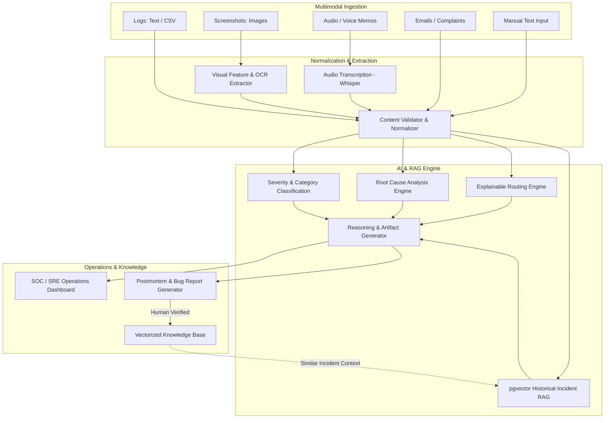

# IncidentIQ: AI-Powered Multimodal Incident Intelligence & Response System

IncidentIQ is a production-grade, multimodal incident management and intelligence platform designed for modern Site Reliability Engineering (SRE), DevOps, and IT Operations teams. It ingests diverse operational evidence—including plain/structured logs, screenshots, audio voice reports, customer complaints, emails, and historical tickets—and leverages multimodal reasoning, RAG (Retrieval-Augmented Generation), and deterministic heuristics to accelerate incident triage and resolution.

---

## 🎯 Project Overview & Core Goals

Modern incident response is slowed down by fragmented evidence scattered across disjoint channels (monitoring alerts, screenshots in chat, customer support tickets, voice notes from on-call engineers). 

**IncidentIQ solves this by:**
1. **Unifying Multimodal Evidence**: Ingesting logs, UI screenshots, audio notes, emails, and complaints into a single structured incident case.
2. **AI-Assisted Root Cause & Severity Analysis**: Providing evidence-backed hypotheses for root cause, severity classification (P1–P4), and affected system topology.
3. **Intelligent Team Routing**: Explaining routing recommendations to engineering disciplines (DevOps, Database, Network, Security, Backend, Frontend).
4. **Historical Knowledge RAG**: Transforming resolved incident postmortems into a searchable vector knowledge base that surfaces high-similarity past incidents and their verified solutions.
5. **Operational Artifact Generation**: Automatically composing standardized bug reports, incident timelines, remediation playbooks (immediate, short-term, long-term), and executive summaries.
6. **Human-in-the-Loop Governance**: Giving on-call engineers the ability to inspect, correct, and validate AI conclusions before committing them to the permanent knowledge base.

---

## 🏛️ System Architecture



---

## 📂 Repository Structure

```
incidentiq/
├── frontend/             # Single-Page Application (React / Vite)
├── backend/              # Core API Services (FastAPI, Pydantic, SQLAlchemy)
│   └── app/
│       ├── api/          # Route controllers and endpoints
│       ├── core/         # Security, configuration, and logging
│       ├── db/           # Database sessions and migrations
│       ├── models/       # SQLAlchemy ORM models
│       ├── schemas/      # Pydantic request/response schemas
│       ├── services/     # Business logic & AI pipelines
│       │   ├── incident/
│       │   ├── ingestion/
│       │   ├── multimodal/
│       │   ├── rag/
│       │   ├── classification/
│       │   ├── routing/
│       │   ├── summarization/
│       │   └── recommendations/
│       └── utils/
├── ai/                   # Prompts, model abstractions, and reasoning pipelines
├── data/
│   ├── raw/              # Raw source datasets (git-ignored)
│   ├── processed/        # Normalized incident records
│   ├── synthetic/        # Synthetic multimodal scenarios
│   └── samples/          # Test files and fixtures
├── scripts/              # Dataset inspection, cleaning, and seeding scripts
├── tests/                # Unit, API, and integration test suites
├── docs/                 # Architectural specifications and design records
├── docker/               # Container configurations
├── .env.example          # Environment variables template
├── .gitignore            # Git exclusion rules
└── README.md             # Project documentation
```

---

## 📊 Core Data Architecture

IncidentIQ differentiates between real public data and curated synthetic scenarios:

1. **Real Public Data**:
   - **IT Incident Dataset**: Real-world IT incident records for historical training and benchmarking.
   - **LogHub Sources**: Supplementary operational log streams (HDFS, OpenStack, BGL, Apache) used for realistic log pattern evaluation.
2. **Synthetic Multimodal Scenarios**:
   - Explicitly tagged synthetic data scenarios (Database connection failure, API latency spike, Kubernetes pod crash, Disk exhaustion, Auth failure, Network outage, etc.) combining synchronized logs, screenshots, audio transcripts, and email complaints.

---

## 🚀 Quickstart & Prerequisites

### Prerequisites
- **Python**: 3.11+ (Python 3.14 compatible)
- **Node.js**: 20+ (Node v24 compatible)
- **Database**: PostgreSQL 15+ with `pgvector` extension (or local mock for standalone development)

### Initial Setup
1. Clone the repository:
   ```bash
   git clone https://github.com/Kishore-iiitk/IncidentIQ.git
   cd IncidentIQ
   ```
2. Configure environment settings:
   ```bash
   cp .env.example .env
   ```
3. Consult [`docs/development.md`](docs/development.md) for detailed environment setup, testing procedures, and milestone conventions.

---

## 🗺️ Milestone Roadmap

The project is built incrementally following strict quality gates:

- [x] **Milestone 01**: Project initialization, directory topology, baseline configurations (`chore: initialize incidentiq project`)
- [x] **Milestone 02**: Architecture documentation and design specifications (`chore: add project architecture and documentation`)
- [x] **Milestone 03**: Incident dataset ingestion pipeline (`feat(data): add incident dataset ingestion pipeline`)
- [x] **Milestone 04**: Log ingestion pipeline (`feat(data): add log ingestion pipeline`)
- [ ] **Milestone 05**: PostgreSQL schema and pgvector migrations (`feat(db): add PostgreSQL schema and migrations`)
- [ ] **Milestones 06–26**: Core APIs, Multimodal AI, RAG, Frontend Dashboard & Verification

---

## 📄 License & Attribution

Designed and developed under clean-architecture principles for enterprise incident response.
