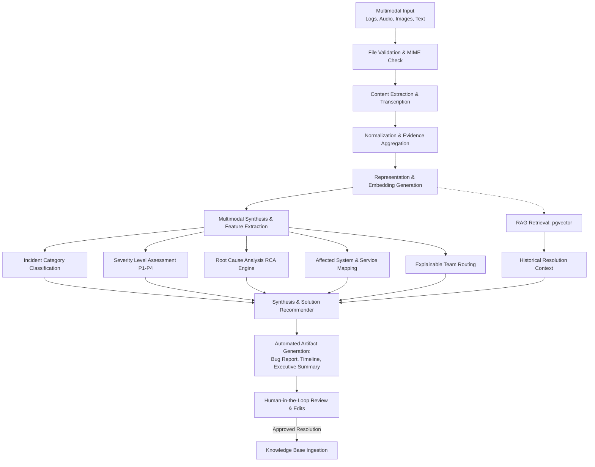

# IncidentIQ Multimodal AI Pipeline Specification

This document details the multimodal inference lifecycle, evidence extraction methodologies, structured reasoning phases, and evidence-grounded hypothesis principles in **IncidentIQ**.

---

## 1. End-to-End Pipeline Workflow

The incident intelligence engine executes as a staged, observable pipeline:



---

## 2. Multimodal Ingestion & Feature Extraction

### 2.1 Text & Customer Communications
- **Sources**: Incident descriptions, forwarded alert emails, customer tickets, Slack threads.
- **Processing**: Regex-based token masking for PII/tokens, header extraction, sentiment/urgency scoring, and chronological thread parsing.

### 2.2 Operational Logs (Plain Text & Structured CSV)
- **Sources**: Server logs (syslog, Nginx, Apache), container logs (Kubernetes, Docker), distributed system logs (HDFS, OpenStack, BGL).
- **Processing**:
  - Timestamp normalization into ISO-8601 UTC.
  - Log level detection (`FATAL`, `ERROR`, `WARN`, `INFO`, `DEBUG`).
  - Anomaly clustering and repetitive stack trace deduplication.
  - Extraction of error codes, HTTP status codes, and affected hosts/services.

### 2.3 Visual Evidence & Application Screenshots
- **Sources**: Browser error snapshots, dashboard alerts, APM trace graphs, console stack traces.
- **Processing**:
  - Visual OCR extraction to detect visible error dialogs, stack traces, and URL endpoints.
  - Multimodal Vision AI parsing to recognize application UI context (e.g., checkout page, login screen, Grafana dashboard).
  - Cross-referencing visual errors against simultaneously occurring log records.

### 2.4 Audio & Voice Reports
- **Sources**: On-call engineer voice notes, incident bridge recordings, verbal dispatch memos (`.mp3`, `.wav`, `.m4a`).
- **Processing**:
  - Transcription via Whisper (local or API provider).
  - Speaker diarization (where applicable) and timestamped transcript generation.
  - Merging transcripts into the normalized evidence graph alongside logs and visual evidence.

---

## 3. Evidence-Grounded Hypothesis Philosophy

> [!IMPORTANT]
> IncidentIQ treats all AI findings as **evidence-backed hypotheses**, not infallible truths. The system explicitly refrains from claiming certainty when evidence is ambiguous or incomplete.

### 3.1 Structured RCA Schema
The root cause analysis engine produces a structured schema containing:
```json
{
  "probable_root_cause": "PostgreSQL connection pool exhaustion caused by unclosed connections in the payment microservice",
  "confidence": 0.88,
  "confidence_rationale": "Direct alignment between 504 Gateway Timeouts in Nginx logs, active pool alerts in APM screenshot, and engineer voice memo",
  "supporting_evidence": [
    "Nginx log: upstream timed out (110: Connection timed out) while reading response header",
    "Screenshot 1: Grafana DB pool saturation at 100% capacity from 09:14 UTC"
  ],
  "contradicting_evidence": [
    "Primary database host CPU utilization remained low (18%) during the incident window"
  ],
  "alternative_hypotheses": [
    {
      "hypothesis": "Network partition between AWS VPCs preventing DB reachability",
      "likelihood": "Low",
      "reason_discounted": "Direct TCP connectivity verified on port 5432; pool connection wait queue was full, not unreachable"
    }
  ],
  "recommended_next_checks": [
    "Inspect payment-service HikariCP configuration for connection leak leaks",
    "Review deployment diff for payment-service v2.14.0 released 20 minutes prior to incident"
  ]
}
```

### 3.2 Severity Assessment Engine
Severity is calculated using multi-factor objective scoring:
- **P1 (Critical)**: Total outage of core revenue/critical services, active data loss risk, zero failover availability.
- **P2 (High)**: Major service degradation affecting significant customer percentage, redundancy compromised.
- **P3 (Medium)**: Non-critical feature impairment, internal tooling outage, workaround available.
- **P4 (Low)**: Minor UI cosmetic defect, transient non-impacting warnings, documentation discrepancy.

### 3.3 Explainable Team Routing
The routing service assigns incidents to functional teams (`Backend`, `Frontend`, `DevOps`, `Database`, `Network`, `Security`, `Cloud`, `Infrastructure`, `Support`) and must output explicit human-readable reasons (e.g., `"Repeated container restart events (OOMKilled) in production namespace"`).
