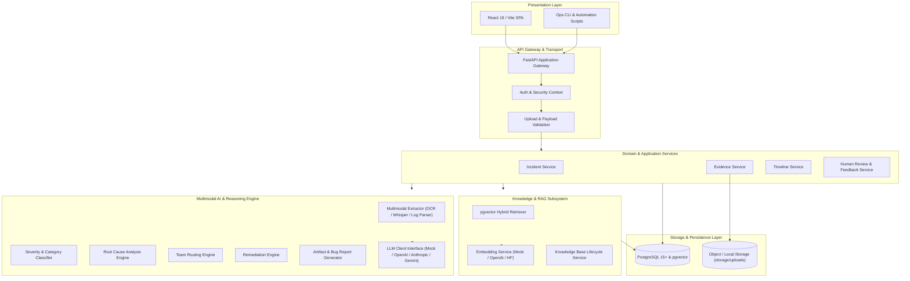

# IncidentIQ System Architecture

This document defines the high-level architecture, module decomposition, component interactions, and engineering invariants of the **IncidentIQ** multimodal incident intelligence platform.

---

## 1. Architectural Overview

IncidentIQ is organized around a clean, layered hexagonal/modular architecture separating ingestion, domain logic, multimodal AI inference, vector retrieval, persistence, and client interfaces.

---

## 2. Component Decomposition

### 2.1 Backend (`backend/app/`)
- **`main.py`**: FastAPI entrypoint configuring middleware (CORS, Request ID tracking, structured logging, global exception sanitization) and registering API routers under `/api`.
- **`core/`**: Security primitives, global settings (`config/`), and structured logging configuration.
- **`db/`**: Database session lifecycle management (Async SQLAlchemy 2.0 engine, async sessionmaker).
- **`models/`**: SQLAlchemy declarative ORM models defining normalized entities with strict foreign key constraints.
- **`schemas/`**: Pydantic v2 data transfer objects (DTOs) for incoming request payloads and structured responses.
- **`api/`**: REST endpoint controllers organized by resource (`incidents`, `evidence`, `analysis`, `knowledge_base`, `dashboard`).
- **`services/`**: Pure domain and business logic modules:
  - `incident/`: Incident lifecycle management, state transitions, and SLA tracking.
  - `ingestion/`: File intake, MIME verification, virus/content sniffing, and safe disk persistence.
  - `multimodal/`: Extraction from logs, images (OCR/Vision), and audio (Whisper transcription).
  - `rag/`: Vector search, similarity filtering, top-k ranking, and prompt grounding.
  - `classification/`: Heuristic and model-driven severity and incident categorization.
  - `routing/`: Assignment team recommendations with explicit explanatory rationales.
  - `summarization/`: Executive briefings and non-technical stakeholder updates.
  - `recommendations/`: Tiered remediation generation (immediate, short-term, long-term).

### 2.2 AI Engine (`ai/`)
- Centralizes LLM prompts, structured function-calling schemas, few-shot templates, and fallback mock generators.
- Every model output conforms to strict JSON schemas backed by Pydantic validators.

### 2.3 Knowledge Base & RAG (`backend/app/services/rag/`)
- Integrates PostgreSQL with `pgvector` to store semantic embeddings alongside structured incident postmortem metadata.
- Distinguishes current incident evidence from historical references during reasoning.

### 2.4 Frontend (`frontend/`)
- Single-page application built with modern React, Vite, and component-driven CSS.
- Features: Real-time SOC dashboard, multimodal upload dropzones, timeline visualization, and human-in-the-loop review screens.

---

## 3. Core Architectural Invariants

1. **Separation of AI Logic from Transport**: No prompt engineering or LLM calls reside in API route handlers. All AI operations are encapsulated in testable service classes.
2. **Separation of ORM and API Contracts**: Database entities (`models/`) are never leaked directly to API consumers. Pydantic schemas (`schemas/`) govern serialization and deserialization.
3. **Deterministic Local Fallbacks**: If external AI API keys are not supplied in `.env`, the system transparently utilizes local deterministic mock services, ensuring full offline functionality.
4. **Non-Destructive Ingestion**: Raw log and incident datasets are strictly read-only; cleaned and normalized artifacts are written to `data/processed/`.
5. **Human-in-the-Loop Verification**: AI-generated root causes, severities, and bug reports remain drafts until reviewed and approved by an on-call engineer before publication to the RAG knowledge base.
