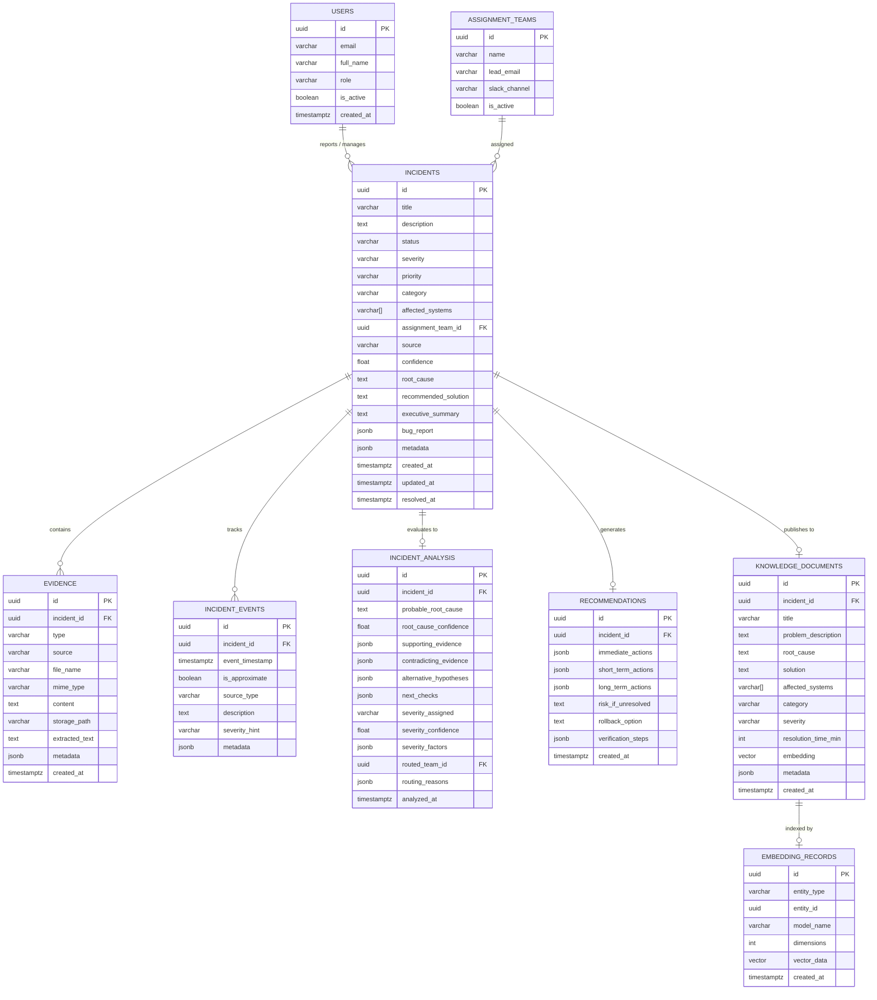

# IncidentIQ Database & Persistence Specification

This document details the relational and vector database schema for **IncidentIQ**, utilizing PostgreSQL 15+ and the `pgvector` extension.

---

## 1. Entity-Relationship Model



---

## 2. Table Specifications & Indexing Strategy

### 2.1 `incidents`
- Stores primary normalized incident state.
- **Indexes**:
  - `idx_incidents_status` (`status`) for operational queues.
  - `idx_incidents_severity` (`severity`) for prioritization.
  - `idx_incidents_created_at` (`created_at DESC`) for timeline sorting.
  - `idx_incidents_team` (`assignment_team_id`) for routing queries.

### 2.2 `evidence`
- Stores normalized pointers to uploaded evidence and OCR/transcripts.
- Foreign key: `incident_id` REFERENCES `incidents(id)` ON DELETE CASCADE.
- **Indexes**:
  - `idx_evidence_incident_id` (`incident_id`)
  - `idx_evidence_type` (`type`)

### 2.3 `incident_events`
- Chronological timeline events extracted across logs, communications, and system alarms.
- Foreign key: `incident_id` REFERENCES `incidents(id)` ON DELETE CASCADE.
- **Indexes**:
  - `idx_incident_events_time` (`incident_id`, `event_timestamp ASC`)

### 2.4 `knowledge_documents` & Vector Indexing
- Stores verified postmortems for similarity search.
- Field: `embedding vector(1536)`
- **Index**:
  - HNSW (Hierarchical Navigable Small World) index for fast approximate nearest neighbor (ANN) retrieval:
    ```sql
    CREATE INDEX idx_knowledge_docs_embedding_hnsw 
    ON knowledge_documents 
    USING hnsw (embedding vector_cosine_ops)
    WITH (m = 16, ef_construction = 64);
    ```
  - B-Tree index on `category` and `affected_systems` (using GIN) for filtered hybrid vector queries.
