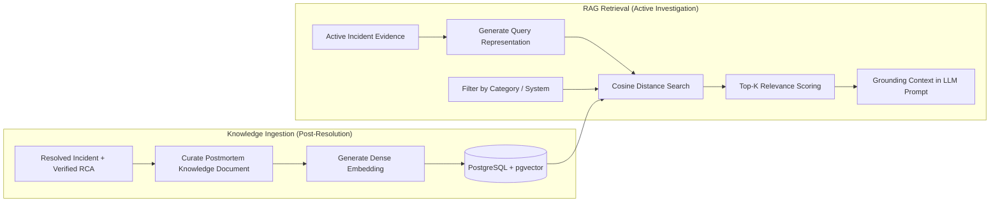

# IncidentIQ Knowledge Base & RAG Architecture

This document describes the Retrieval-Augmented Generation (RAG) subsystem in **IncidentIQ**, detailing vector indexing, hybrid retrieval mechanisms, grounding workflows, and knowledge base lifecycle management.

---

## 1. RAG Subsystem Overview

IncidentIQ leverages **PostgreSQL with the `pgvector` extension** as its primary vector store. By co-locating relational incident metadata with dense vector embeddings, the system performs efficient hybrid queries combining cosine similarity with relational metadata filtering (e.g., category, affected systems, severity).



---

## 2. Knowledge Document Schema

Each resolved incident is transformed into a standardized knowledge record:

| Field | Type | Description |
|---|---|---|
| `id` | `UUID` | Primary key identifier |
| `incident_id` | `UUID` | Foreign key referencing original incident |
| `title` | `VARCHAR(255)` | Normalized summary of the issue |
| `problem_description`| `TEXT` | Detailed failure mode and symptoms |
| `root_cause` | `TEXT` | Verified and postmortem-approved root cause |
| `solution` | `TEXT` | Verified remediation steps and permanent fix |
| `affected_systems` | `VARCHAR[]` | Array of impacted services/hosts |
| `category` | `VARCHAR(64)` | Incident domain classification |
| `severity` | `VARCHAR(16)` | Resolved severity rating (`P1`, `P2`, `P3`, `P4`) |
| `resolution_time_min`| `INTEGER` | Time-to-resolution in minutes |
| `embedding` | `vector(1536)` | Dense semantic embedding vector |
| `metadata` | `JSONB` | Additional telemetry, tags, author, and SLA markers |
| `created_at` | `TIMESTAMPTZ` | Timestamp of knowledge entry |

---

## 3. Retrieval Pipeline

1. **Representation Generation**: A normalized query string is synthesized from the active incident's extracted evidence:
   ```text
   Category: Database | Systems: [payment-db, auth-service] | Symptoms: Connection timeout 504 pool exhausted
   ```
2. **Dense Vector Search**: The query representation is converted to an embedding (via OpenAI `text-embedding-3-small`, HuggingFace, or mock fallback) and compared using cosine distance:
   ```sql
   SELECT id, incident_id, title, root_cause, solution, 1 - (embedding <=> :query_vec) AS similarity
   FROM knowledge_documents
   WHERE category = :incident_category OR :incident_category IS NULL
   ORDER BY embedding <=> :query_vec
   LIMIT :top_k;
   ```
3. **Hybrid Filtering**: RAG queries can enforce hard constraints (e.g., must match `affected_systems` or `category`) or soft re-ranking based on recency and resolution effectiveness.
4. **Context Isolation**: When grounding the LLM prompt, retrieved historical incidents are quarantined within explicit `<historical_reference>` XML tags to prevent the model from hallucinating historical facts into the current incident evidence.
